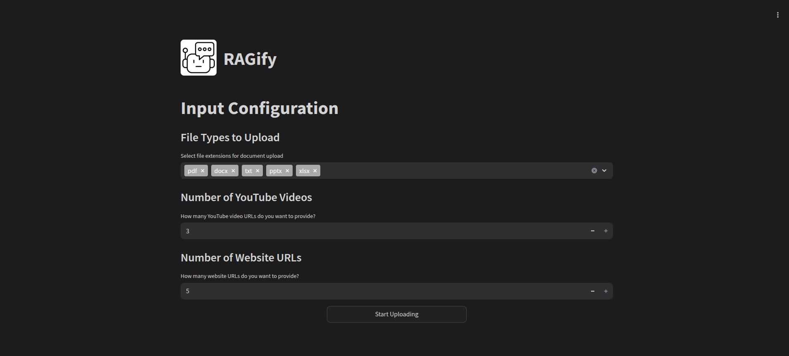
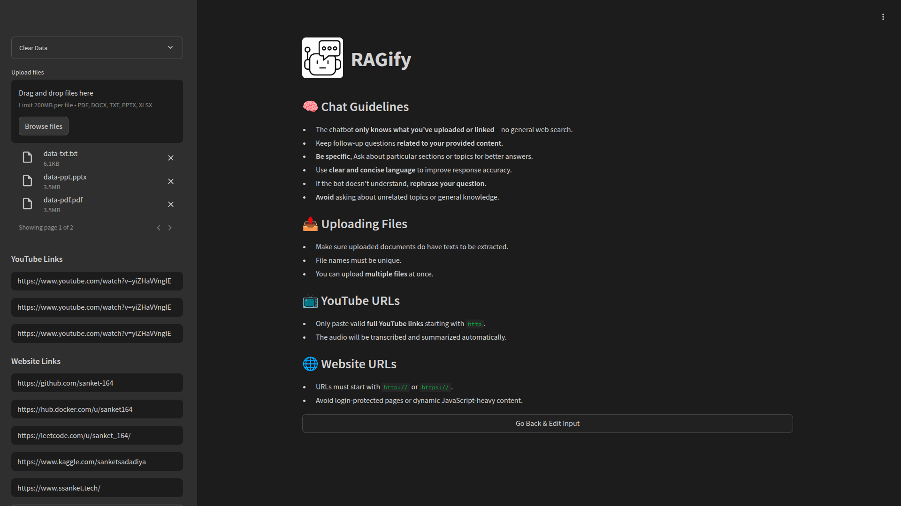
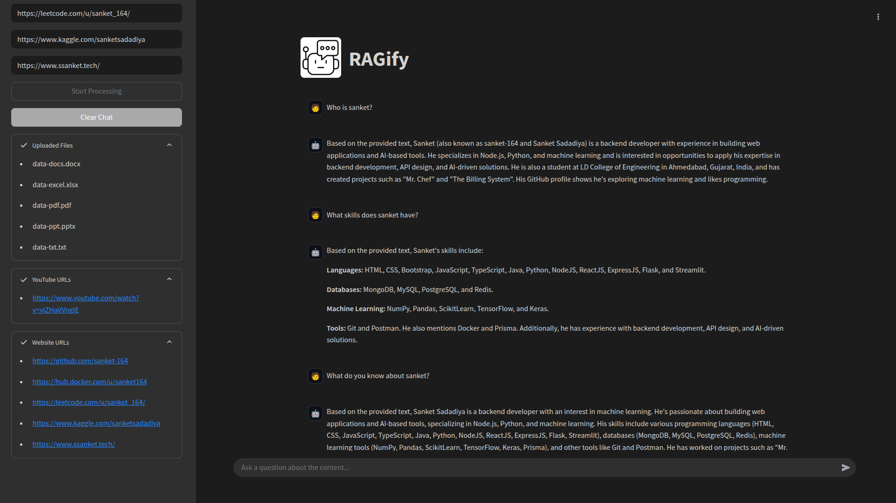

# RAGify

**RAGify** is a Retrieval-Augmented Generation (RAG) tool that lets users interact with content from various sources such as YouTube videos, websites, PDFs, DOCs, PPTs, TXTs, and Excel files. Upload or link your data and start asking questions — RAGify handles chunking, embedding, retrieval, and answering with context-aware responses.

## Features

- **YouTube URL Upload**
  - Extract transcripts and interact with video content.
- **Website URL Upload**
  - Scrape and analyze web pages for key information.
- **Document Upload** (Supports multiple formats including)
  - PDF
  - PowerPoint (PPTX)
  - Word Documents (DOCX)
  - Text Files (TXT)
  - Excel Sheets (XLSX)
- **RAG Techniques**
  - Use natural language to ask questions about your uploaded content.
  - Leverage state-of-the-art models to retrieve and generate accurate responses.
  - Chat with any uploaded content using RAG pipeline.
  - Context-aware QA with embeddings and vector search.


## Screenshots

### Input Configuration


### Uploading Content


### Interacting with Uploaded Data


### Installation

1. **Clone the Repository**
    ```bash
    git clone https://github.com/sanket-164/RAGify.git
    ```

2. **Naviagte to Project Directory**
    ```bash
    cd RAGify
    ```

3. **Set Up Environment Variables**
   - Create a `.env` file in the root directory and add the following environment variables:

      ```plaintext
      GOOGLE_API_KEY= (get it from https://aistudio.google.com/apikey)
      USER_AGENT='Mozilla/5.0 (Windows NT 10.0; Win64; x64) AppleWebKit/537.36 (KHTML, like Gecko) Chrome/102.0.0.0 Safari/537.36'
      ```

4. **Install Dependencies**
   - Use the following command to install required packages:
      ```bash
      pip install -r requirements.txt
      ```

5. **Run the Application**
   - Start the Streamlit app with:
      ```bash
      streamlit run app.py
      ```

### Example Queries

- "What is the main topic discussed in this document?"
- "Summarize the content of the YouTube video."
- "Extract all tables from the Excel sheet."

## Tech Stack

### User Interface & Core Functionality
- **Streamlit**: A powerful open-source Python library used for building interactive web applications with minimal effort. Streamlit allows RAGify to have a clean, responsive, and user-friendly interface.
- **LangChain**: An advanced framework that simplifies the integration of large language models (LLMs) into applications. LangChain powers the natural language processing and querying capabilities of RAGify.

### Document Processing
- `PyPDF2, python-pptx, python-docx, Pandas, Openpyxl`

### Web Scraping & YouTube Integration
- `BeautifulSoup4, Requests, Pytube`

## Contributing

We welcome contributions from the community! Here's how you can help:

1. Fork the repository.
2. Create a new branch (`git checkout -b feature/YourFeatureName`).
3. Commit your changes (`git commit -m 'Add some feature'`).
4. Push to the branch (`git push origin feature/YourFeatureName`).
5. Open a pull request.


## License

This project is licensed under the MIT License.
